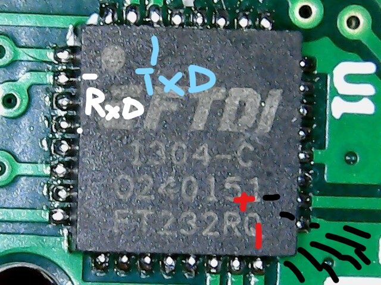

# Arduino Uno Display Tripcomputer for the KW1281 KKL K-Line protocol

This code is for the Arduino Uno with a 16x2 Display Shield.

For the Arduino Mega with a TFT LCD Display Shield look into [this repo](https://github.com/RXTX4816/OBD-KKL-KW1281-ARDUINO-TFTLCD-TRIPCOMPUTER)


## Welcome
Simple trip computer for the Arduino Uno with a 16x2 Screen to display useful information in all VAG vehicles with the MARELLI 4LV ECU (VAG Number: 036906034AM). This includes most Golf mk4/Jetta/Bora from the years around 2000 that are limited to the K-Line communication and the KW1281 protocol. Newer cars since around 2005 began to adapt OBD-2 with CAN communication, that can be accessed through a ELM327 controller. No such simple controller exists currently for KKL.

This repo contains all necessary files. The only file containing code is [obdisplay.cpp](src/obdisplay.cpp). Buy an Arduino Uno, a 16x2 Screen to stick on the board and the Autodia K409 KKL OBD to USB cable (or similar).

## Setup
Find the RX and TX connections on the AutoDia K409 board (open the OBD-site plastic) and cut them where appropiate. 

Here are the instructions:



Refer to the [linked git repo](https://github.com/mkirbst/lupo-gti-tripcomputer-kw1281) for pictures and a bit more info. Hook the working side of both connections where you just cut to the RX and TX pins of your Arduino Uno (Watch out, since RX(Recieve) and TX(Transmit) depends on the perspective) by cutting the USB Male plug.  

Open the project with platformIO and flash it to your arduino. Done. Make sure to adjust the Baud Rate and find out which ECU Addresses are available in your car.

## Label Files
The measurement groups of each ECU Addres contain 4 values. Each different version of each car may have a different order of values and different values to obtain. To know which groups display which values you either need to search for your cars Label File "xxx-xxx-xxx.LBL" or hook up VCDS (or any other software to display measurement groups) and record your display while clicking through the groups to get a rough image what these values correspond to.

Here are the values for the 036906034AM MARELLI ECU for the 1.6 16V Engine, which partly does not contain label files:
```cpp
const uint8_t ADDR_ENGINE = 0x01;
// Label File: None
// Measurement Blocks - 0x08:
// Group 00: 1-10 with 3 digit numbers
// Group 01: 0 /min RPM, 17.0°C Temperature, 0.0% Lambda, 10110010 Binary Bits **
// Group 02: 0 /min RPM, 0.0% Load, 0.0ms Time Correction, 1012.0 mbar Absolute Pressure
// Group 03: 0 /min RPM, 1012.0 mbar Absolute Pressure, 5.4° T.B. Angle, 0.0° Steering Angle **
// Group 04: 0 /min RPM, 11.70 V Voltage, 17.0°C Temperature, 14°C Temperature **
// Group 05: 0 /min RPM, 0.0% Load, 0.0 km/h Speed, Part Throttle NA
// Group 06: 0 /min RPM, 0.0% Load, 14°C Temperature, -1.0% Lambda **
// Group 14: 0 /min RPM, 0.0% Load, 0.0 no units, Enabled NA
// Readiness - 0x15:
// Readiness Status: 10100101
// Exhaust Gas Recirculation: Failed or Incomplete
// Oxygen Sensor Heating: Passed
// Oxygen Sensor(s): Failed or Incomplete
// Air Conditioning: Passed
// Secondary Air Injection: Passed
// Evaporative Emissions: Failed or Incomplete
// Catalyst Heating: Passed
// Catalytic Converter(s): Failed or Incomplete
const uint8_t ADDR_ABS_BRAKES = 0x03; // UNUSED
// Label File: None
// Measurement Blocks - 0x08:
// Group 4: 0.00° Steering Angle, 0.31 m/s^2 Lateral Acceleration, -0.36°/s Turn Rate, N/A
// Group 5: -1.27 bar Pressure, 0.42 bar Pressure, N/A, N/A
const uint8_t ADDR_AUTO_HVAC = 0x08; // UNUSED
// Label File: 381-907-044.LBL
// Measurement Blocks - 0x08:
// Group 1: 8.0 A/C clutch sw-off cond. 1-12, 0.0 Eng. speed recog (0=no, 1=yes), 0.0 km/h Road Speed, 121.0 Standing time (0-240min.)
// Group 2: 42.0 Measured Value, 42.0 Specified Value, 219.0 Position: air supply cooled, 42.0 Position: air supply heated
// Group 3: 221.0 Measured Value, 221.0 Specified Value, 221.0 Position: air flow to panel, 40.0 Position: air flow to footwell
// Group 4: 223.0 Measured Value, 223.0 Specified Value, 223.0 Position: air flow to footwell, 39.0 Position: air flow to defroster
// Group 5: 237.0 Measured Value, 234.0 Specified Value, 234.0 Position: fresh air, 30.0 Position: recirculating
// Group 6: 0.0°C Temp displayed on panel, 7.0°C Temp. air intake duct, 0.0°C Outside air temperature, 0.0% Sun photo sensor (0-120%)
// Group 7: 0.0 Outlet temp. panel (G191), 5.0°C Outlet temp. floor (G192), 3.0°C Panel temp. near LCD (G56), 0.0 n/a
// Group 8: 0.00V Specif. Voltage air blower, 0.28V Measured Voltage air blower, 12.18V Measured Voltage A/C clutch, 0.0 no units
const uint8_t ADDR_INSTRUMENTS = 0x17;
// Label File: 1J0-920-xx0.LBL
// Measurement Blocks - 0x08:
// Group 1: 0.0 km/h Speed, 0 /min Engine Speed, Oil Pr. 2 < min (Oil pressure 0.9 bar), 21:50 Time
// Group 2: 121960 Odometer, 9.0 l Fuel level, 93 ohms Fuel Sender Resistance, 0.0°C Ambient Temperature
// Group 3: 12.0°C Coolant temp., OK Oil Level (OK/n.OK), 11.0°C Oil temp, N/A
```

## Credit
Thanks to many wonderful projects for making this project less painful than it already is.

[Blafusel](https://www.blafusel.de/obd/obd2_kw1281.html) with a detailed overview on the KW1281 protocol and the communication between the microcontroller and the ECU.

[mkirbst's existing code](https://github.com/mkirbst/lupo-gti-tripcomputer-kw1281) helped a lot to get the  mainframe going. His code did not work on my car, although he has a very similar one to mine using the same protocol. He refers to some connection problems, which I also got that can only be caused by the software. This project eliminates connection problems by implementing a procedure for error messages by the ECU. 

## Caution
This is an early version and I'm only releasing it to help on anyones journey with this VAG mess. You need to manually remove connections and solder cables on an OBD to USB board and hook them up to the Arduino Uno TX and RX pins. You need to turn ignition ON for the ECU to start. This software should not break anything in the ECU, since only the measure groups are accessed. Depending on your car, you may need to adapt this code for various values. 

This project may work with other Arduino's, Displays, OBD cables and VAG cars.

## Problems
The OBD 12V from the car should be enough to power on the Arduino, but in my case the +12V and Ground lines of the USB cable do nothing, so just hook it up like a smartphone through the cigarrete lighter USB.

If you have questions feel free to send me a message. Will accept all merge requests if they work. 

## Future
Will add sometime in the future:
- DTC Error reading and DTC Error deletion.
- LEDs + Sound on critical warnings (Oil pressure, temperature too high, DTC errors)
- Correct disconnect procedure. Currently there is none, the microcontroller just stops sending. 
- Bigger Display, maybe with touch even.


