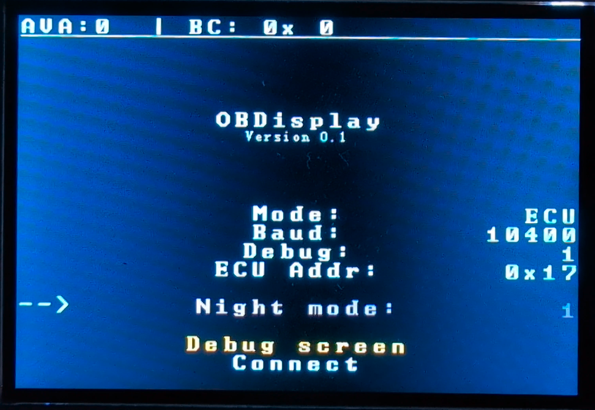
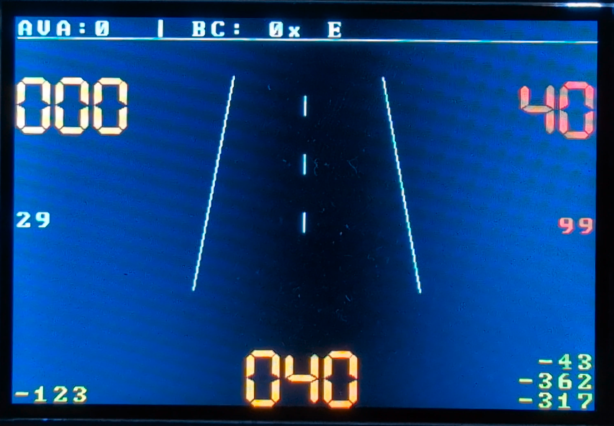
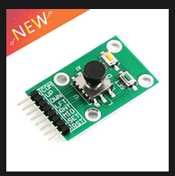
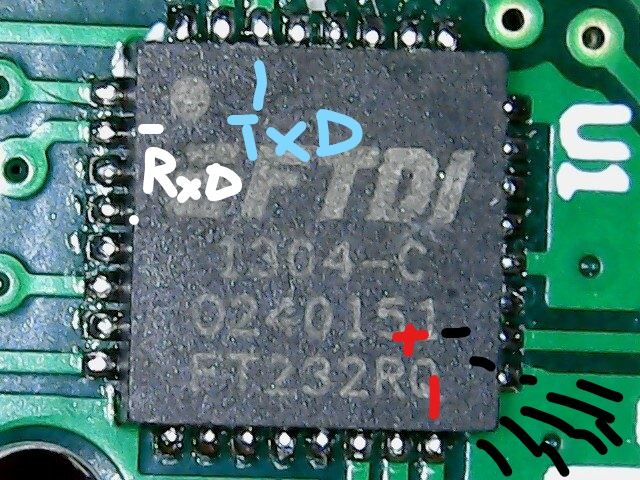

# Arduino Mega Tripcomputer for KWP1281 VAG Cars

This code is for the Arduino Mega with a 480x320 Non-Touch Color Display Shield.
 
The code for the Arduino Uno with a 16x2 Display Shield can be found in the [ARDUINO_UNO branch](https://github.com/RXTX4816/OBD-KKL-KW1281-ARDUINO-TRIPCOMPUTER/tree/ARDUINO_UNO)





Cockpit: From left to right, top to bottom
km driven,  L fuel remaining,  coolant temp,  fuel / 100km - km remaining
Yellow debug timers:
menu switch time, draw time, frame time (2x)

Other screens: Experimental, DTC, Custom Debug, Settings, Group reading(Coming soon)

## This repo depends on [KLineKWP1281Lib](https://github.com/domnulvlad/KLineKWP1281Lib) 

## Welcome
Simple trip computer for the Arduino Mega with a 480x320 Non-Touch Color Display Shield to display useful information in all VAG vehicles with the MARELLI 4LV ECU (VAG Number: 036906034AM). This includes most Golf mk4/Jetta/Bora from the years around 2000 that are limited to the K-Line communication and the KW1281 protocol. Newer cars since around 2005 began to adapt OBD-2 with CAN communication, that can be accessed through a ELM327 controller. No such simple controller exists currently for KKL.

You can find the project files in the src directory.
Domnulvlad's [KLineKWP1281Lib](https://github.com/domnulvlad/KLineKWP1281Lib) is a hard dependency and added as a submodule in ROOT/lib/KLineKWP1281Lib/... 

## [ECU](https://github.com/RXTX4816/OBD-KWP1281-Arduino-ECU-Emulator) Emulator

If you don't want to test on a real ECU just turn your Arduino Mega into a ECU with [OBDServer](https://github.com/RXTX4816/OBD-KWP1281-Arduino-ECU-Emulator)

## Features
- Supported baud rates 1200, 2400, 4800, 9600, 10400
- Supports KWP1281 K-Line through KLineKWP1281Lib
- 3 operating modes: Acknowledge, Group reading, Sensors reading
- Read, view and delete DTC Errors (Coming soon)
- Simulation mode to test the display
- KWP1281 exit procedure

## Installation

Dependencies:
`python -m pip install --upgrade platformio`

Build:
`pio run 2>&1`

Flash:
`todo`

Or just use VS Code with Platformio extension to have the buttons in the bottom line.

## Setup

 
I used this button it has UP DOWN LEFT RIGHT MIDDLE_CLICK SET_CLICK AND RESET_CLICK but any will do.

Requirements: Arduino Mega (ATmega2560-16AU CH340G), 3.5" TFT LCD Module shield 5V 480x320 RGB ILI9486/ILI9488 16bit parallel interface no touch, Autodia K409 KKL OBD to USB cable. Be careful with the display since such a high resolution RGB display draws a lot of current and all display panels require an operating voltage of 3.3V. The Arduino Mega does not provide 3.3V at such high current draws so make sure you either buy a Shield with voltage adjusters included with an operating voltage of 5V or you step down it yourself. 

Look inside the OBD cable and note which MCU is placed (E.g. FT232R or FT232RQ), get its datasheet, find the RXD and TXD pins, solder the first visible contact point to your Arduino digital pins of your liking (Here: 19 and 18 = RX1 & TX1) and cut both lines after the contact point. Don't forget to solder the +5V and GROUND from your Arduino to the OBD cable MCU (Just use the USB stripped male on the platine) since without it no communication is possible. You should have 4 cables connected between your OBD cable and your Arduino and a seperate USB or power souce input to power the Arduino and access its Serial debug communication.

```
Not all pins on the Mega and Mega 2560 boards support change interrupts, so only the following can be used for RX: 10, 11, 12, 13, 14, 15, 50, 51, 52, 53, A8 (62), A9 (63), A10 (64), A11 (65), A12 (66), A13 (67), A14 (68), A15 (69). Not all pins on the Leonardo and Micro boards support change interrupts, so only the following can be used for RX: 8, 9, 10, 11, 14 (MISO), 15 (SCK), 16 (MOSI).
```

See the pictures below for visual guidance.




Refer to the [linked git repo](https://github.com/mkirbst/lupo-gti-tripcomputer-kw1281) for pictures and a bit more info. 

Older ECU's (<1997) may use very slow baud rates like 1200 or 2400, while newer ECU's (>1997) most often use baud rates around 9600 and 10400. I have not encountered baud 4800 yet.

## UI

##### KWP_INIT
To initialize a connection through OBD KWP1281 K-Line send a 5 baud init, acknowledge the sync bytes and receive the connect blocks. Make sure you don't IDLE in this phase or else the ECU may do nonsense.

##### KWP_LOOP
After initialization you can select 3 KWP_MODES: 
- 0 = Keep connection alive, send acknowledge blocks
- 1 = Read all values from all groups from ECU. (ECU dependent, you may need to adapt to yours)
- 2 = Read the 4 values from one group. (ECU independent, see group menu)

Manual exit, DTC read and delete blocks are only send if the user manually presses the specified UI button.

## Label Files
The measurement groups of each ECU Addres contain 4 values. Each different version of each car may have a different order of values and different values to obtain. To know which groups display which values you either need to search for your cars Label File "xxx-xxx-xxx.LBL" or hook up VCDS (or any other software to display measurement groups) and record your display while clicking through the groups to get a rough image what these values correspond to.

## Credit
Thanks to many wonderful projects for making this project less painful than it already is.

[Blafusel](https://www.blafusel.de/obd/obd2_kw1281.html) with a detailed overview on the KW1281 protocol and the communication between the microcontroller and the ECU.

[mkirbst's existing code](https://github.com/mkirbst/lupo-gti-tripcomputer-kw1281) helped a lot to get the  mainframe going. His code did not work on my car, although he has a very similar one to mine using the same protocol. He refers to some connection problems, which I also got that can only be caused by the software. This project eliminates connection problems by implementing a procedure for error messages by the ECU. 

[domnulvlad's KLineKWP1281Lib](https://github.com/domnulvlad/KLineKWP1281Lib) a very well thought and beautifully implemented library. At first this project began on an UNO with Softwareserial, and since I didn't know better I created something from scratch that was far inferior and had many bugs (ARDUINO_UNO branch). After seeing that library I realised that creating an UI and the Backend may be too much, so I'm happy to include it as a dependency :)

## Caution
------------------------------------------------------------
#### Use this at your own risk. Be cautious. Damaging your car or your cars ECU is possible. Wrong wiring and setup can create a fire hazard. In rare cases the airbags can deploy when reading DTC errors on 0x15. The OBD was meant to be a diagnostics port only, by using a tripcomputer through it the workload on the ECU increases.  
------------------------------------------
This is an early version and I'm only releasing it to help on anyones journey with this VAG mess. You need to manually remove connections and solder cables on an OBD to USB board and hook them up to the Arduino Uno TX and RX pins. You need to turn ignition ON for the ECU to start. This software should not break anything in the ECU, since only the measure groups are accessed. Depending on your car, you may need to adapt this code for various values. 

Be careful when working with the Airbag Address 0x15 since in some rare circumstances when an electrical failure is given in the airbag system and DTC error codes are deleted the airbag can deploy on affected ECU's. I would hardly advise not to touch the Airbag controller with selfmade code.

This project may work with other Arduino's, Displays, OBD cables and VAG cars.

## Problems
If you have questions feel free to open an issue and paste your Serial log there. 

Contributions are welcomed. 

## Future
I'm not planning to add the following to this project but feel free to contribute:
- LEDs + Sound on critical warnings (Oil pressure, temperature too high, DTC errors)
- Adaptation support
- Login support
- Save read_connect_blocks() info about ECU and display it
- Memory optimizations


